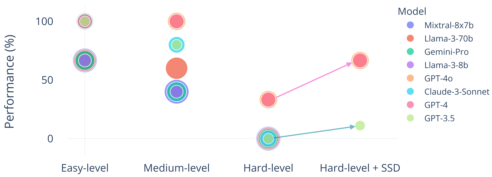

## Abstract
Large language models (LLMs) have achieved remarkable success in natural language processing (NLP), demonstrating significant capabilities in processing and understanding text data. However, recent studies have identified limitations in LLMs’ ability to reason about graph-structured data. To address this gap, we introduce GraphEval36k, the **first** comprehensive graph dataset, comprising 40 graph data structure problems along with 36,900 test cases. Additionally, we introduce an evaluation framework based on GraphEval36k, designed to assess the graph reasoning abilities of LLMs through coding challenges. Our dataset categorizes test cases into four primary and four sub-categories, ensuring a comprehensive evaluation. We evaluate eight popular LLMs on GraphEval36k, revealing that LLMs exhibit a better understanding of directed graphs compared to undirected ones. While private LLMs consistently outperform open-source models, the performance gap is narrowing. Furthermore, to improve the usability of our evaluation framework, we propose Structured Symbolic Decomposition (SSD), an instruction-based method designed to enhance LLM performance on GraphEval36k. Results show that SSD improves the performance of GPT-3.5, GPT-4, and GPT-4o on complex graph problems, with the increase of 11.11%, 33.37%, and 33.37%, respectively.

<!-- ## Key Contributions
Clearly highlight **what makes your research innovative** and **why it matters**.  -->

## Methodology
#### Pipeline
<div style="text-align: left;">
    

    <p><em>Figure 1: Overview of the Evaluation Framework. For each problem, we input problem statement, data examples, and code framework to LLMs. And then they complete the code and give explanations. Finally, the framework evaluates the code on GraphEval36k and returns the result details.</em></p>
</div>
<br>
<div style="text-align: left;">
    

    <p><em>Figure 2: The overview pipeline of GraphEval36k dataset construction.</em></p>
</div>
<br>

#### Structured Symbolic Decomposition
To enhance the usability of our evaluation framework and GraphEval36k, we introduce Structured Symbolic Decomposition (SSD), an instruction-based method utilizing test cases from GraphEval36k for graph problems. Our approach aims to enable LLMs to perform better graph reasoning, especially, for hard-level problems.

##### Instructions for LLM

The instructions are composed of four parts: *problem clarification*, *problem breakdown*, *solution formulation*, and *program implementation*.

- **Problem Clarification:**
    1. Cognitive Step: *You must first understand and clearly articulate the problem, including all inputs and desired outputs.*
    2. Action Step: *Identify and list any specific rules, constraints, or conditions that influence the solution. Use the test case examples to assist the understanding.*
  
- **Problem Breakdown:**
    1. Cognitive Step: *Decompose the problem into smaller, manageable sub-problems, translating it into a symbolic form and identifying the key components and relationships within the problem.*
    2. Action Step: *Outline the sequential steps required to solve the overall problem.*
  
- **Solution Formulation:**
    1. Cognitive Step: *Formulate solving strategies using the symbolic form developed in the previous step and define the algorithms and methods needed to address each sub-problem.*
    2. Action Step: *Detail the algorithms and approaches for each sub-problem, ensuring they are logically connected and comprehensive.*

- **Program Implementation:**
    1. Cognitive Step: *Conceptualize the implementation of each solution component.*
    2. Action Step: *Write a program for each breakdown part, ensuring it aligns with the formulated strategy. Run test cases to verify the correctness of each component.*


## Visual Results
<div style="text-align: left;">
    

    <p><em>FEvaluation Results on GraphEval36K. This table presents the passing rates (%) of LLMs across various graph categories. The first row lists the names of the evaluated LLMs, while the first column categorizes the graphs as follows: "SG" denotes sparse graphs, "PG" denotes planar graphs, "RG" denotes regular graphs, "DG" denotes dense graphs and "CG" denotes complete graphs. Additionally, the following abbreviations are used to describe graph characteristics: "c" for connected graphs, "dc" for disconnected graphs, "cy" for cyclic graphs, and "acy" for acyclic graphs. This classification corresponds to Figure 3. The passing rates (%) are represented as "directed | undirected" for each graph category, where the number preceding the bar indicates the result for directed graphs, and the number following the bar indicates the result for undirected graphs. "NA" signifies that the category is not applicable. We bold the largest number in each row.</em></p>
</div>
<br>
<div style="text-align: left;">
    

    <p><em>Figure 4: Passing rate comparison across eight LLMs, focusing on GPT-3.5, GPT-4, and GPT-4o to highlight the performance gains from using SSD</em></p>
</div>

<!-- ## Contact Information
- [Qiming Wu](mailto:qimingwu@cs.ucsb.edu)
- [Zichen Chen](mailto:zichen_chen@ucsb.edu)
- [Will Corcoran](mailto:wcorcoran@ucsb.edu)
- [Misha Sra](mailto:sra@ucsb.edu)
- [Ambuj K. Singh](mailto:ambuj@cs.ucsb.edu)


## Citation
Please cite this paper as follows:

```bibtex
@article{wu2024grapheval36k,
  author    = {Qiming Wu and Zichen Chen and Will Corcoran and Misha Sra and Ambuj K. Singh},
  title     = {GraphEval36K: Evaluating Coding and Reasoning Capabilities of Large Language Models on Graph Datasets},
  year      = {2024},
}
``` -->
